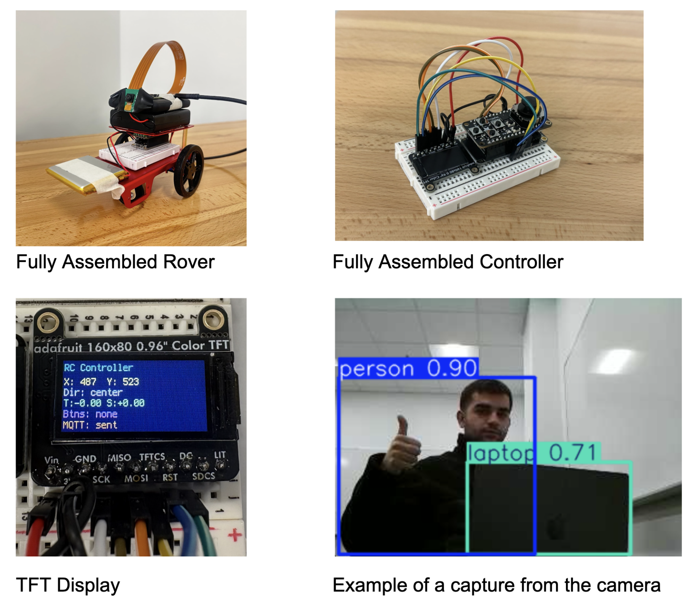

**Project Name:** RC Car w/ Camera  
**Team:** Cai, Yahya, and Charlie

## **Introduction**

Our goal in this project was to build a fun, engaging embedded systems project that brings together the topics we found most compelling over the semester. Specifically, we wanted to design a wirelessly controlled RC car that could detect obstacles and display its surroundings, using core course themes including I2C, Pulse Width Modulation (PWM), peripheral interfacing, and the MQTT communication protocol. As the project evolved, integrating a camera further increased our motivation, as beyond remote control, we were able to move toward perception, developing a live video feed and an object detection interface that can identify objects autonomously. During the research and development phase, we consulted references on drive steering logic, MQTT infrastructure and a public broker, and the Adafruit CircuitPython library ecosystem. Our preliminary citation list includes: a Robotics StackExchange post on standard differential-drive equations, documentation for the Mosquitto test broker, HiveMQ MQTT concepts documentation, background material on TCP, and the Adafruit CircuitPython Library Bundle.

## **Methods:**

### **Hardware overview and design choices**

Our system consists of two main embedded subsystems:

1. **Controller (remote)**  
   * **ESP32 Feather HUZZAH32** (server role).  
   * **Adafruit Joy FeatherWing** for joystick and buttons.  
   * **Mini TFT display** to provide real time user feedback.  
2. **Car**  
   * **ESP32 Feather HUZZAH32** (client role).  
   * **Adafruit DC Motor \+ Stepper FeatherWing** to drive the motors.  
   * **Assembled car chassis with wheels and motors**  
   * **A 3.3V Lithium battery, Triple-A battery pack, and portable charging block**  
   * **Raspberry Pi Zero W with a Raspberry Pi Camera**  
     

We chose to use the ESP32s and FeatherWings within the CircuitPython ecosystem because there was strong support for both of the FeatherWings, including libraries created for both of them. The Joy FeatherWing provides a simple joystick and button input interface, while the DC Motor \+ Stepper FeatherWing abstracts many motor control details.

### 

### **Software environment and libraries**

We configured both boards to use CircuitPython and installed the Adafruit CircuitPython Library Bundle, which provided the specific drivers needed for the Joy FeatherWing, TFT display, and motor wing.

**Libraries used on both boards** included:

* **adafruit\_minimqtt**: Implements a MQTT client so the joystick board can publish control messages and the motor board can subscribe to them over WiFi.  
* **adafruit\_bus\_device**: Provides shared low-level I2C/SPI bus helpers that many sensor, display, and motor drivers rely on.  
* **adafruit\_connection\_manager.mpy**: Simplifies WiFi connection setup and network management for the boards.  
* **adafruit\_ticks.mpy**: Provides timing utilities for various functions.

**Controller board-specific libraries:**

* **adafruit\_display\_text**: Adds text support for TFT screens using Circuit Python’s display system.  
* **adafruit\_seesaw**: Lets the joystick board communicate with the Joy FeatherWing’s Seesaw I2C chip to read joystick axes and button states.  
* **adafruit\_featherwing**: Offers helpers for working with Adafruit FeatherWing add-ons.  
* **adafruit\_st7735r:** initializes and drives the ST7735R-based TFT so the TFT can render our background and live joystick/MQTT text on the screen`.`(display driver).

**Motor board-specific libraries:**

* **adafruit\_motor**: Defines core DC motor and stepper motor control classes used by the higher level motor libraries.  
* **adafruit\_register**: Supplies register read/write abstractions used inside PCA9685.  
* **adafruit\_motorkit.mpy**: Gives a simple API to control DC motors and steppers on the DC Motor \+ Stepper FeatherWing.  
* **adafruit\_pca9685.mpy**: Controls the PCA9685 PWM chip that generates the signals needed to drive the FeatherWing’s motors.

**Communication architecture (MQTT)**  
After assembling the car and configuring the coding environment, our main objective became achieving stable wireless control between the controller ESP32 and client ESP32. We implemented this using MQTT over WiFi and used a free public test broker (test.mosquitto.org) to publish joystick command payloads and retrieve them by subscribing to the rc/drive topic they were sent to.

In the beginning, it’s vital to have the correct communication configurations. The desired wifi’s SSID and password are set up using variables to make communication more readable. If a student wants to use MQTT for either board, they need to enroll the device in the IOT network. This will give them a device specific password. Next, we picked the free mosquito test broker and chose to listen on port 1883, which is unencrypted and unauthenticated. This choice of port was determined because we wanted the lowest latency and didn’t care if our rc car commands were left unencrypted. Additionally, there are many other free brokers available and we merely chose this one because it’s well-documented. MQTT allows us to send and receive information using a communication protocol that runs on top of TCP. We chose MQTT over one-to-one options like bluetooth due to CircuitPython’s robust libraries and the long-range communication it enables.

### **Controller logic and UI (integrates user input and visual feedback):**

The Controller logic and UI is constructed in the Controller.py script. It functions to establish an MQTT client with the broker, read data from the FeatherWing to the TFT display and ESP32, and publish necessary data to the broker for the client to subscribe and read from. We include three simple helper functions. Joystick\_direction determines the joystick’s verbal direction based on its coordinates, button\_pressed relays which buttons are being pressed, and map\_axis normalizes the joystick’s direction to either 1, 0, or \-1 for simpler motor movement.

We initialized I2C between the Joy FeatherWing and the ESP32. We then read joystick axes and button states using the Seesaw interface, which abstracted a lot of the technicality out of the communication between board and featherwing. The buttons were configured using pull-up resistors and all changed into their input state. We used bit masking to combine multiple buttons into a single BUTTON\_MASK variable for efficient, readable state monitoring. We additionally included a helper function that returns an array of all buttons currently being pressed. In order to provide a more accessible and enhanced experience for the user, we write a lot of information, including (joystick position, direction, buttons being pressed, and more), to the TFT display for the user to directly see.

The rest of the Controller logic is continuously looped, since the aforementioned parts help to set up the MQTT client and TFT display. The controller interacts with the MQTT broker to publish user commands, which are then received by the client ESP32. It does this by reading both the x and y coordinates of the joystick and mapping them to values of either \-1 or 1\. A dictionary is then created with keys “throttle” and “steer”. The value corresponding to the y-axis of the joystick determines the throttle and the value corresponding to the x-axis of the joystick determines the steer. This creates two key-value pairs that are converted into a JSON object and published to the broker’s “rc/drive” topic. It’s important to include the mqtt\_client.loop() at the end of the code in order to keep the connection to the broker alive.

### **Car motor-control logic:**

The car’s logic is constructed in the Car.py script. It creates an MQTT client with the broker, subscribes to the broker and reads published data, and forces the cart’s movement based on the information it receives. It uses received MQTT messages to determine and execute the cart's direction using a combination of both motors.

The car starts by configuring its own MQTT setup (Wifi Connection, Port selection, Broker) and subscribing to the rc/drive topic to receive joystick command payloads from the controller. On the client side, we created an on\_message function that parses the received JSON messages that include the “throttle” and “steer” data. This helper function is attached to the client object and is called whenever a message is received on a subscribed topic. Using CircuitPython, we cannot stress how much easier the adafruit\_minimqtt library makes configuring the client, subscribing to the topic/broker, and maintaining the communication connection. 

We use the throttle and steer information to compute the left and right wheel commands using a mixing approach inspired by the method from [https://robotics.stackexchange.com/questions/8990/standard-equation-for-steering-differential-drive-robot](https://robotics.stackexchange.com/questions/8990/standard-equation-for-steering-differential-drive-robot): 

* left \= throttle \+ steer  
* right \= throttle – steer  
* Values are then clamped into \[-1, 1\] before being applied to the motor driver.

This design gives intuitive motion mapping, with forward input moving both wheels forward, backward input moving both wheels back, and steering inputs adding or subtracting power differentially from each wheel to turn. We use the clamped values to turn the motor using the adafruit\_motorkit library. It’s important to include the mqtt\_client.loop() at the end of the code in order to keep the connection to the broker alive.

**Camera and Perception Subsystem**  
We extended the rover with perception capabilities to move beyond basic remote control. Adding a camera transforms the rover from a simple remote controlled toy into a platform capable of inspection, exploration, and future autonomous behavior. The camera subsystem runs independently from the ESP32 motor control and consists of two main components: the mounted capture system and a laptop based processing pipeline.

**Hardware and Network Architecture**  
On the rover, a Raspberry Pi Camera Module connects to a Raspberry Pi Zero W, chosen for its small form factor, low power consumption, and built-in WiFi. Rather than routing video through the campus IoT network (which introduced latency issues for motor control), we configured the Pi to broadcast its own WiFi hotspot called "raspi." This creates a dedicated, low-latency link between the rover and the receiving laptop, isolating video traffic from MQTT control messages. The laptop connects to this hotspot and receives the video stream over TCP on port 8554\.

**Streaming Implementation**  
On the Raspberry Pi, we use picamera2, the current official Python library built on rpicam which is the modern camera stack that replaced the legacy Broadcom tools (picamera and raspivid). The Pi captures 640x480 video and streams using hardware accelerated MJPEG encoding at 5 Mbps. We chose MJPEG over H.264 because it encodes frames independently, eliminating keyframe synchronization issues and ensuring that dropped packets only affect individual frames rather than corrupting subsequent ones.

On the laptop, a Python script receives the stream using a threaded architecture that separates frame capture from processing. The frame reader thread continuously parses incoming TCP data by searching for JPEG start (0xFF 0xD8) and end (0xFF 0xD9) markers, decoding complete frames with OpenCV's imdecode function. By running capture in a separate thread, the main processing loop always works with the most recent frame available, dropping older frames if processing falls behind. This "latest frame only" strategy really helped us with lag and failure as any discrupency would cause the stream to freeze. This prioritizes responsiveness for real-time applications, showing what the rover sees now matters more than displaying every frame in sequence, which is kind of what we want. 

**Object Detection with YOLO**  
We use YOLOv8n (the "nano" variant) from the Ultralytics library for object detection. YOLO (You Only Look Once) predicts bounding boxes and class labels in a single forward pass through a neural network, rather than using slower two-stage approaches. YOLOv8n is optimized for edge deployment, offering a balance between speed and accuracy with approximately 3.2 million parameters. Running inference at 480-pixel resolution, the model outputs detections for 80 object categories from the COCO dataset. In testing, we reliably detected people, chairs, bottles, backpacks, and laptops in the lab environment at 15-20 fps. A 180-degree frame rotation compensates for our camera's mounting orientation.

We chose this distributed architecture, we capture on the Pi, processing on the laptop, because the Pi Zero W lacks computational power for neural network inference at reasonable framerates. This separation keeps the rover lightweight and power efficient while enabling real-time detection on the laptop. It also provides flexibility for future development, as we could swap in different models, add tracking algorithms, or implement autonomous behaviors without modifying the rover hardware. The dedicated hotspot, while adding setup complexity, proved essential for consistent streaming performance compared to our initial attempts using the shared campus network.

**Comparison to different projects**  
Our rover follows a common hobbyist pattern but differs in key ways from projects we referenced. Most ESP32 RC car tutorials use Bluetooth or direct WiFi (ESP-NOW) for lower latency, while we opted for MQTT to learn the publish and subscribe model used in IoT applications. This tradeoff gave us more flexibility but introduced the latency issues described below. We were also limited with Circuit Python and bluetooth accessibility. Compared to the differential drive implementations on Robotics StackExchange, our steering logic uses the same mixing equations. The camera is where our project diverges most from typical builds. Most hobbyist rovers either skip perception entirely or use the ESP32-CAM module for basic streaming. By adding a separate Raspberry Pi with YOLO object detection, we created a two-tier architecture that allows us to have flexibility on what we do with the streaming once we have it and how we built the camera module. implementing it taught us about the challenges of coordinating multiple embedded devices.

### **Bill of Materials:**

| Item | Supplier | Quantity | Unit Cost | Total Cost |
| :---- | :---- | :---- | :---- | :---- |
| [2 Adafruit HUZZAH32 \- ESP32 Feather Boards](https://www.adafruit.com/product/3405) | Adafruit | 2 | N/A  | N/A  |
| [Adafruit Joy FeatherWing for all Feathers](https://www.adafruit.com/product/3632) | Adafruit | 1 | $9.95 | $9.95 |
| [Ultrasonic Distance Sensor \- 3V or 5V \- HC-SR04 compatible \- RCWL-1601](https://www.adafruit.com/product/4007#technical-details) | Adafruit | 1 | $3.95 | $3.95 |
| [Mini Robot Rover Chassis Kit \- 2WD with DC Motors](https://www.adafruit.com/product/2939) | Adafruit | 1 | $24.95 | $24.95 |
| [4 x AA Battery Holder with On/Off Switch](https://www.adafruit.com/product/830) | Adafruit | 1 | $2.95 | $2.95 |
| [DC Motor \+ Stepper FeatherWing Add-on For All Feather Boards](https://www.adafruit.com/product/2927) | Adafruit | 1 | $19.95 | $19.95 |
| [Lithium Ion Battery \- 3.7V 2000mAh](https://www.adafruit.com/product/2011) | Adafruit | 2 | $14.95 | $29.90 |
| [Adafruit 0.96" 160x80 Color TFT Display w/ MicroSD Card Breakout \- ST7735](https://www.adafruit.com/product/3533?srsltid=AfmBOorPlH1fYF0ruyoweEds45mlHWj_vq54adTNNa4kunRU4pWbw6hp) | Adafruit | 1 | $7.95 | $7.95  |
| [Half-Size Breadboard with Mounting Holes](https://www.adafruit.com/product/4539) | Adafruit | 2 | $5.00 | $10.00 |
| [Premium Male/Male Jumper Wires \- 20 x 6" (150mm)](https://www.adafruit.com/product/1957) | Adafruit | 2 | $1.95 | $3.90 |
| [Raspberry Pi Zero W](https://www.adafruit.com/product/3400?gad_source=1&gad_campaignid=21079227318&gbraid=0AAAAADx9JvT-38gxhnBUjp_V0urcSNzfv&gclid=CjwKCAjwgeLHBhBuEiwAL5gNEZ7p02g71dCHg3Tppy2PNzVQ8vhmJCnJ14CGmPQvcN0QH0-JM9v4vhoCc6sQAvD_BwE) | Adafruit | 1 | $15.00 | $15.00 |
| [Adafruit STEMMA Speaker \- Plug and Play Audio Amplifier \- JST PH 2mm](https://www.adafruit.com/product/3885?gad_source=1&gad_campaignid=21079227318) | Adafruit | 1 | $5.00 | $5.00 |
| [AM2320 Digital Temperature and Humidity Sensor](https://www.adafruit.com/product/3721) | Adafruit | 1 | $3.95 | $3.95 |
| [Stacking Headers feather \- 12-pin and 16-pin female headers](https://www.adafruit.com/product/2830) | Adafruit | 1 | $1.25 | $1.25 |
| [STEMMA JST PH 2mm 3-Pin to Male Header Cable \- 200mm](https://www.adafruit.com/product/3893) | Adafruit | 1 | $1.25 | $1.25 |
| TOTAL COST: |  |  |  | $140.90 |

Not all the materials from the BOM were used, but most of them could be implemented with more time. Notably, the speaker (and corresponding cable), temperature and humidity sensor, and distance sensor were not implemented. The only unnecessary item was the second LION battery and set of cables. Additionally, the raspberry pi camera and power bank used to power the pi itself were sourced from our personal collections.

## **Results:**

Our final prototype successfully demonstrates end-to-end wireless control. The rover receives joystick derived commands over MQTT and translates them into left/right/forward/backward motor signals, enabling basic driving. We also implemented camera based perception using a Raspberry Pi Zero W and a laptop based YOLO detection system. This expands the rover from a purely remote controlled device into a platform capable of basic scene understanding and future autonomy experiments.  
Fully Assembled Rover 		Fully Assembled Controller  
TFT Display				Example of a capture from the camera

**Where Our Car Fails:**  
One of the most persistent issues we encountered was input latency between our controller and the rover. Because our control signals are sent over WiFi using MQTT, there is a noticeable delay between a joystick movement and when the car actually receives and executes the command. In practice, this latency reduces the precision of our driving, making turns feel slightly delayed or inconsistent, and causing small corrective adjustments to often arrive too late to actually help in smoothing out the car’s trajectory. 

We believe this delay is most likely caused by network and broker constraints rather than our high-level control logic. Our two leading hypotheses are as follows. First, variability or congestion on the Middlebury IoT WiFi, and second, the natural limitations of using a free public test broker, which may introduce unpredictable routing delays and inconsistent message timing. As a result, even though we believe our control pipeline is functionally correct, real world performance is limited by the reliability of this communication layer. This issue influenced our final results and is a major motivation for future work focused on improving transmission efficiency and overall responsiveness.

## **Accessibility:**

**Current Features**  
The live video feed and object detection overlays let users operate the rover without needing to see it directly. This helps people with limited mobility or difficulty judging distances since they can drive the rover and see its surroundings entirely through the laptop screen. The YOLO labels also help by pointing out objects in the environment automatically.

**Possible Improvements**  
The joystick controller could be swapped for other input methods. Voice control would allow hands-free driving for users who have trouble with fine hand movements. Simple button controls could replace the joystick for users who find it hard to use. The TFT display text is currently small, so larger fonts and higher contrast would help users with poor vision read it more easily. We also thought about adding a horn or speaker to the rover so users with visual impairments could track where it is by sound. We purchased a speaker for this but ran out of time to add it.

**Positive Uses**  
Camera-equipped rovers like ours are used in search and rescue to explore collapsed buildings and find survivors in dangerous or tight spaces. With our rover, the YOLO model could even be trained to spot people in rubble. While our project is just a learning prototype, it shows the basic idea behind these real-world tools and gives us a hands-on way to learn embedded systems.

## **Ethical implications:**

Our project involves dual use technology, as the same patterns underlying remote driving, wireless video, and object detection can be repurposed in military, policing, or surveillance contexts. This raises concerns about unintended real-world applications if similar designs are scaled or distributed.

The onboard camera also introduces privacy and consent risks. The system could record or stream individuals without permission, especially in indoor or crowded contexts. We hope to emphasize safe use norms and limits on data storage and access control through this report. While our project is intended to demonstrate learning and experimentation, it’s important to highlight responsible usage, including respecting privacy and ensuring the technology is not used in any unethical situations.

Lastly, we got the parts from Adafruit. While Adafruit designs many of its boards and accessories in the United States, the exact sources of the raw materials used in these components are not fully understood. It’s important to acknowledge that many materials in electronics are sourced from areas that raise ethical concerns, such as using environmentally harmful practices and exploitative labor. Should we continue on this project, we’d like to dive into these implications deeper. 

**Schedule:**

### **Original schedule (directly from our proposal)**

1. **Rover assembly:** Mount Feather, wire motors/power/sensor. (0.5–1 day)  
2. **Controller assembly & UI:** Attach Joy FeatherWing and TFT, read joystick, implement speed/direction display. (1–2 days)  
3. **BLE communication:** Create GATT connection and commands (speed, turn, speed increase), pairs and exchange messages. (2–3 days)  
4. **Variable-speed motor control:** Implement PWM on ESP32 for turning and speed increases/decreases. (\~1 week)  
   1. **Minimum Completion Milestone:** A rover that can change speeds/directions given input from a controller.   
5. **Obstacle detection & stop:** State machine (CLEAR to WARN to STOP), re-enable that direction only when distance \> threshold. (1–2 days)  
6. **Implement Optional Add-ons:** Configure camera, temperature sensor, and speaker if time allows (in that order). (Remaining time)  
7. **Presentation:** Create report and prepare the presentation on our rover, complications in the process, and what specific features we included. 

### **Schedule actually followed**

In practice we followed a schedule more like this:

1. Assemble Car  
2. Configure Coding Environment  
3. Write test code (for both featherwings, using tft display to test the joystick)  
4. Raspberry Pi & Camera Configuration  
5. Configure MQTT  
6. Write code for sending joystick inputs and converting those inputs into motor controls

We originally expected a fairly direct build path that consisted of assembling the rover and controller, implementing BLE, then spending most of our time on upgrades like variable speed PWM, obstacle detection, and optional add-ons. In practice, we had to devote much more time to foundational setup and debugging like figuring out the FeatherWings and CircuitPython libraries, establishing reliable MQTT communication over WiFi, and configuring the Raspberry Pi camera, which slowed our pace and reduced how many upgrades we could actually implement by the end. The use of CircuitPython also led to a clear pivot away from our planned BLE approach toward a WiFi/MQTT architecture that was better supported.

## **Issues encountered:**

* **Connecting components:** A major practical issue was the physical assembly of the rover. We didn’t fully anticipate the need for strong mounting materials and reliable mechanical fastening, so several components ended up roughly taped or glued to the chassis. This made the build less stable overall, and our wheels fell off multiple times during testing, forcing repeated repairs and slowing our progress.  
    
* **Configuring CircuitPython and Locating Libraries:** Another significant challenge was identifying and installing the correct CircuitPython libraries for both boards and their FeatherWings. This process involved a lot of trial and error because many libraries depend on additional libraries that are not always obvious at first glance. We spent substantial time cross-referencing Adafruit documentation to make sure we had the exact combination needed for joystick input, display output, and motor control.  
    
* **Camera:** Basic configuration steps like locating the Raspberry Pi’s MAC address took hours, and we eventually needed Professor Vaccari’s help to resolve the issue so we could connect it to the college’s IoT network (If only they print it at the back of the chip\!). After that, we still experienced frequent connection and stability problems between the Pi, the hotspot, and the laptop video, which made reliable testing difficult. This led us to rely on TCP with compressing packets of Jpeg frames and sending them, letting TCP handle all error correction and data corruption.  
    
* **MQTT:** Finally, as mentioned in more detail in the results section, the MQTT-based control system was affected by noticeable latency issues.

## **Future work:**

* **Clean up MQTT transmission** to streamline messaging and reduce latency. This could include the use of bluetooth rather than MQTT, however, as discussed previously, both have their own set of advantages and disadvantages.

* **Improve control reliability**, especially turning, using refined steering logic, motor balance, and smoother ramping of turn inputs. Instead of doing a 1 or \-1 message to tell the motors to move, we could make the range continuous depending on how far the joystick is pushed. 

* **Add an object detection distance sensor** for obstacle awareness and automatic stopping/avoidance. We originally bought a distance sensor to stop the cart from encountering any obstacles, but the introduction of the camera superseded the need and time for this to be added.

**References:**  
Norman, Demetrius. “Standard Equation for Steering Differential Drive Robot.” *Robotics Stack Exchange*, 26 Jan. 2016, [robotics.stackexchange.com/questions/8990/standard-equation-for-steering-differential-drive-robot](http://robotics.stackexchange.com/questions/8990/standard-equation-for-steering-differential-drive-robot) 

Eclipse Mosquitto. *test.mosquitto.org*. 2025, [https://test.mosquitto.org/](https://test.mosquitto.org/?utm_source=chatgpt.com)

HiveMQ. *“HiveMQ Platform.”* HiveMQ Documentation,   
[docs.hivemq.com/hivemq/latest/user-guide/index.html](http://docs.hivemq.com/hivemq/latest/user-guide/index.html)

Geeks for geeks: Transmission Control Protocol \- TCP [https://www.geeksforgeeks.org/computer-networks/what-is-transmission-control-protocol-tcp/](https://www.geeksforgeeks.org/computer-networks/what-is-transmission-control-protocol-tcp/)

Adafruit Industries. “Adafruit CircuitPython Library Bundle.” *CircuitPython Documentation*, [https://docs.circuitpython.org/projects/bundle/en/latest/index.html](https://docs.circuitpython.org/projects/bundle/en/latest/index.html)

Rubell, Brent. “Connecting to a MQTT Broker.” *MQTT in CircuitPython*, Adafruit Learning System, 23 July 2019, last edited 01 Apr. 2025, [https://learn.adafruit.com/mqtt-in-circuitpython/connecting-to-a-mqtt-broker](https://learn.adafruit.com/mqtt-in-circuitpython/connecting-to-a-mqtt-broker?utm_source=chatgpt.com)
